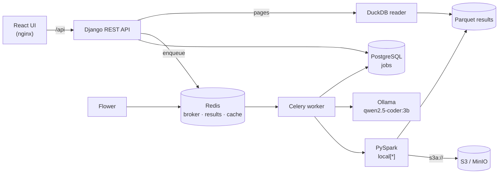

# NL Regex Platform

A web application for transforming large CSV and Excel files stored in S3 using plain-English instructions. You choose a file and columns, then describe what you want, for example "find email addresses", "dates as YYYY-MM-DD" or "mask personal data". A local LLM turns that into a validated regex or specification, and a Celery worker applies it to every row with PySpark. Jobs run asynchronously with live progress, cancellation and paginated results, and the pipeline has been exercised on files with millions of rows.

**Stack:** Django REST Framework · Celery · Redis · PySpark · React (Vite + TypeScript) · PostgreSQL · Ollama (local LLM) · MinIO (S3 in development) · Docker Compose.

> **Live demo: https://rhombus-ai.duckdns.org** · **[Demo video](https://drive.google.com/file/d/1VQrKD5_5hs5_WEDhK873NRXfLwwW5ex9/view?usp=sharing)** — an asynchronous job running from submission to paginated results.

---

## Contents

- [Requirements coverage](#requirements-coverage)
- [Quick start](#quick-start)
- [What it does](#what-it-does)
- [Architecture](#architecture)
- [Partitioning and parallelism](#partitioning-and-parallelism)
- [Performance](#performance)
- [LLM integration](#llm-integration)
- [Credentials](#credentials)
- [Reliability](#reliability)
- [API](#api)
- [Configuration](#configuration)
- [Testing](#testing)
- [Observability](#observability)
- [Trade-offs and limitations](#trade-offs-and-limitations)
- [Deployment](#deployment)
- [Project layout](#project-layout)

---

## Requirements coverage

| Requirement from the brief | How this project meets it |
|---|---|
| Users provide their own S3 credentials and browse their own bucket | `POST /api/s3/connections/` verifies the keys, then holds them encrypted in Redis under an opaque id for 12 hours. Nothing sensitive reaches PostgreSQL or the logs. See [Credentials](#credentials). |
| Import data from Amazon S3 into a PySpark DataFrame | `apps/files` lists bucket objects with boto3; `processing/readers.py` loads CSV and XLSX through `s3a://` (MinIO locally, AWS S3 by configuration) |
| Django backend with separate API, task and data layers; jobs with status and progress; submit returns immediately | `apps/jobs` returns `202` with a job id, then serves polling and paginated results. Jobs have `QUEUED / RUNNING / SUCCESS / FAILED`, a stage and a progress percentage. `processing/` is a framework-free data layer. |
| Heavy work in Celery with Redis as broker, result backend and cache; visible progress; graceful failure, retries and cancellation | `apps/jobs/tasks.py` runs every job; Redis databases 0, 1 and 2 hold broker, results and LLM cache. See [Reliability](#reliability). |
| PySpark engine that scales across partitions and pages results | Built-in Spark functions only, size-based input partitions, one pass per job, DuckDB paging. See [Partitioning and parallelism](#partitioning-and-parallelism). |
| React UI: pick a file, describe a pattern, give a replacement, choose columns, live progress, paginated results, error and empty states | `frontend/src/features` |
| LLM turns plain English into a validated regex (invalid patterns and catastrophic backtracking guarded), cached in Redis | `apps/llm` and `processing/regex_safety.py`. See [LLM integration](#llm-integration). |
| Two additional LLM-driven transformations through the same async Spark pipeline | **Format normalization** and **personal-data masking**. See [What it does](#what-it-does). |
| Docker Compose brings up the whole stack with one command | `docker compose up --build` |
| Evidence on a sizeable dataset | 3,000,000-row benchmark. See [Performance](#performance). |
| Observability: task metrics and worker monitoring | Flower, per-job metrics and job-id logs. See [Observability](#observability). |
| Tests for the task and Spark layers | 272 backend tests, including real Spark and eager Celery tasks, plus 39 frontend tests. See [Testing](#testing). |
| Public deployment | Live at **https://rhombus-ai.duckdns.org** on a single Compute Engine VM, with HTTPS from Let's Encrypt. See [Deployment](#deployment). |
| Demo video | [Linked at the top of this README](https://drive.google.com/file/d/1VQrKD5_5hs5_WEDhK873NRXfLwwW5ex9/view?usp=sharing) |

---

## Quick start

**Prerequisites:** Docker with at least **8 GB of memory** available to containers (Spark uses 2 GB, the local LLM about 2.5 GB).

```bash
git clone https://github.com/haodonguyen/rhombus-ai.git
cd rhombus-ai
docker compose up --build
```

The first start downloads the LLM (`qwen2.5-coder:3b`, 1.9 GB) and the Spark connector jars, so it takes several minutes. Nothing else needs configuring: `docker-compose.yml` provides working development defaults, and you can override any of them in a `.env` file (see [`.env.example`](.env.example)). No API keys are required.

| Service | URL |
|---|---|
| Web app | http://localhost:3000 |
| API | http://localhost:8000/api/health/ |
| Flower (Celery monitoring) | http://localhost:5555 (admin / admin) |
| MinIO console (S3) | http://localhost:9001 (minioadmin / minioadmin) |

A seeding job creates the `datasets` bucket with sample files (`samples/customers.csv`, `samples/customers.xlsx`). To try a large file:

```bash
docker compose run --rm minio-seed python /scripts/generate_dataset.py --rows 3000000
```

---

## What it does

1. **Connect to S3.** You supply the access key and secret key of an IAM user that can list and read your bucket, plus the bucket name and region. The keys are checked against the bucket, then encrypted and held server-side for 12 hours; the browser only ever holds an opaque connection id. Deployments may also offer a demo bucket, so the app can be tried without AWS credentials.
2. **Choose a file.** The file browser lists CSV and XLSX objects in the connected bucket, paginated with S3 cursors. Picking a file shows its columns and sample rows.
3. **Choose a transformation and columns.**

   | Transformation | You provide | The LLM produces | Spark applies |
   |---|---|---|---|
   | **Find & replace** | A description ("email addresses"), or a regex directly, plus a replacement value | One regex with flags | `regexp_replace` on every target column |
   | **Normalize format** | The target format ("dates as YYYY-MM-DD", "phone numbers like 555-123-4567") | Date input and output formats, or ordered rewrite rules with group references | `to_date` + `date_format`, or `when`/`regexp_replace` chains |
   | **Mask personal data** | Nothing | Which columns hold which kinds of PII (email, phone, name, card, identifier, address) | Fixed masks: `j***@example.com`, `***-***-9935`, `J. D.`, `[REDACTED]` |

4. **Watch the job.** The API returns `202` with a job id immediately. The UI polls with backoff and shows the status (`QUEUED → RUNNING → SUCCESS / FAILED`), the current stage, a progress bar driven by Spark task completion, and the generated pattern or specification with its explanation. A running job can be cancelled.
5. **Browse results.** Processed rows are paginated server-side, with matched rows highlighted.

The LLM is called **once per job**, never per row. Its answer is validated, cached in Redis and saved on the job, so a retried job never asks again.

---

## Architecture



### Layers

The code keeps a strict separation between the API, task, data and LLM layers:

| Layer | Location | Responsibility | Never does |
|---|---|---|---|
| API | `backend/apps/*/views.py`, `serializers.py`, `services.py` | Validate requests, persist jobs, enqueue, serve results pages | Spark, LLM calls, reading data |
| Task | `backend/apps/jobs/tasks.py`, `transform_builders.py` | Orchestrate a job: status transitions, progress, cancellation, retries, error codes | Transformation logic |
| Data | `backend/processing/` | Pure `DataFrame → DataFrame` transforms, readers, writers, validation | Import Django or Celery |
| LLM | `backend/apps/llm/` | Prompts, structured output, validation, Redis cache | Know about Spark or HTTP requests |

`processing/` has no Django imports, so the Spark code is tested with a plain local `SparkSession`. The LLM provider sits behind a small `StructuredLLM` protocol, so tests use a fake and never reach a model server.

### Job lifecycle

- **Statuses** are exactly `QUEUED`, `RUNNING`, `SUCCESS` and `FAILED`. A cancelled job is `FAILED` with error code `CANCELLED`.
- **Transitions** happen in one place, as a conditional `UPDATE`, so concurrent writers cannot race.
- **Stages** for find and replace: `GENERATING_REGEX → LOADING → TRANSFORMING → FINALIZING`. For normalization and masking: `LOADING → GENERATING_SPEC → TRANSFORMING → FINALIZING`, because the LLM needs a sample of the data first.
- **Results** are written as Parquet, one directory per job. The API reads pages with DuckDB, so the web process never starts Spark.

---

## Partitioning and parallelism

| Choice | Setting | Why |
|---|---|---|
| Input partition size | `spark.sql.files.maxPartitionBytes = 16m` (`SPARK_MAX_PARTITION_BYTES`) | With Spark's default 128 MB, a 270 MB CSV became only 8 partitions on the 8-core worker. All tasks finished in one wave, and progress jumped 18% → 90%. At 16 MB the file becomes 17 partitions: work spreads more evenly, progress moves in steps, and the job went from about 26 s to about 10 s. |
| Executor cores | `SPARK_MASTER = local[*]` | Uses every core of the worker container. Point it at a Spark cluster to scale out without code changes. |
| Shuffle partitions | `spark.sql.shuffle.partitions = 8`, AQE enabled with partition coalescing | The pipeline has almost no shuffles (only the stats aggregation). AQE adapts the few that remain. |
| One pass over the data | Transform and write are a single Spark action | Replacement, matched flag and Parquet write run in one scan. Row and match counts are then read from the Parquet output, touching one column. |
| No Python UDFs | Only built-in functions (`regexp_replace`, `rlike`, `to_date`, `when`) | Everything runs in the JVM per partition; no per-row Python serialization. |
| Stable ordering | `monotonically_increasing_id()` added at read time, before any shuffle | Gives deterministic pagination without `zipWithIndex`, which would force a Python round trip. |
| Paging | Two-step DuckDB query: `LIMIT/OFFSET` over the id column only, then `BETWEEN` on the id range | Parquet row-group statistics prune the second read, so deep pages stay fast. |
| Sampling for the LLM | First 1,000 rows, distinct values per column | A cheap Spark job on files of any size. The spec it produces still applies to every row. |
| Worker concurrency | `--concurrency=1`, `prefetch_multiplier=1` | One Spark application per worker process. Parallelism comes from Spark inside the job, and throughput from adding workers. |
| Excel | `spark-excel` | XLSX is a zip archive and cannot be split, so the read is a single task. Large Excel files are slower than CSV, and previews are limited to 50 MB. |

---

## Performance

Measured on the Docker Compose stack: 8 CPUs and 8 GB of memory for the Docker VM, Spark in local mode.

| Scenario | Result |
|---|---|
| Dataset | 3,000,000 rows, 270 MB CSV (`scripts/generate_dataset.py`) |
| Find & replace (emails in 2 columns), 3M rows | About 10 s end to end; 3,000,000 rows processed |
| Progress on 3M rows | 10 → 50 → 85 → 90 → 100% over 6 s |
| Cancel a running 3M-row job | Spark work stops 1.3 s after the request |
| Results page 30,000 of 30,000 (rows 2,999,901–3,000,000) | About 490 ms |
| Job submission (`POST /api/jobs/`) | 96–147 ms median |
| LLM generation, warm model | 3–7 s per request (about 25 tokens/s on CPU) |
| LLM generation, cold model | About 135 s; the stack warms the model at startup and keeps it loaded |
| Repeated description (cache hit) | Whole job in 0.9 s |

Measured on the deployed instance (Compute Engine `e2-standard-2`, 2 vCPUs, 8 GB), 1,000-row sample file:

| Scenario | Result |
|---|---|
| Find & replace with an explicit regex | 27 s end to end |
| Natural-language job, first request (model cold) | 77 s |
| Natural-language job, warm model | 26 s |

The deployed VM has a quarter of the cores used for the 3M-row benchmark above, so the local LLM dominates its timings; Spark work on the sample file is a few seconds.

---

## LLM integration

- **Provider:** [Ollama](https://ollama.com) runs `qwen2.5-coder:3b` locally in Docker Compose. There's no API key and no per-request cost. The provider is behind one small interface (`apps/llm/client.py`), so a hosted model could replace it.
- **Structured output:** every request passes a Pydantic model's JSON schema as Ollama's `format`, with temperature 0 and a 1,024-token output cap. Responses are parsed and validated; free text is never trusted. If a small model falls into a repetition loop, the cap stops it and the job fails fast with `LLM_INVALID_RESPONSE` instead of timing out and retrying.
- **Caching:** Redis keys are `sha256(prompt version, model, normalized input, data sample)`. Only validated answers are cached, and cached answers are validated again when read. If Redis is down, the cache is skipped rather than failing the job.
- **Prompts:** versioned few-shot prompts live in `apps/llm/prompts/`. Bumping a prompt's version retires its cached answers.

### Regex safety

Spark evaluates regexes with Java's `java.util.regex`, which has no timeout, so one pathological pattern could stall every executor. Every pattern, whether typed by the user or generated, passes these checks in `processing/regex_safety.py` before Spark sees it:

1. **Length and syntax:** a length limit, a compile check, and rejection of Python-only constructs Java does not support (named groups, conditionals, inline comments).
2. **Structure:** rejection of nested or overlapping quantifiers without a disjoint separator (`(a+)+`, `(\w+\s?)*`, `(a|aa)+`), the shapes behind catastrophic backtracking.
3. **Empty matches:** rejection of patterns that can match empty text, which would insert the replacement between every character.
4. **Timing:** timed probes on long adversarial inputs, using the `regex` module's timeout.
5. **JVM compile:** a final compile in the JVM before the transform runs.

Replacement values are escaped for Java, so `$` and `\` are inserted literally. Normalization rules may use `$1`-style group references, but only to groups that exist.

---

## Credentials

The app reads whichever bucket the user connects to, so their AWS keys have to reach the
Spark job without being stored where they could leak.

| Concern | How it is handled |
|---|---|
| In transit | Keys are sent once, to `POST /api/s3/connections/`, over HTTPS. They are never put in a URL or query string. |
| Verification | Before anything is stored, the keys are used for a one-object `list_objects_v2` against the bucket. Wrong keys return `S3_CREDENTIALS_INVALID`, a missing bucket `S3_BUCKET_NOT_FOUND`. |
| At rest | Encrypted with Fernet, using a key derived from Django's `SECRET_KEY`, and held only in Redis under a random 32-character id with a 12-hour lifetime (`S3_CONNECTION_TTL`). |
| In the database | Never. The `Job` row keeps the connection id and the bucket name, nothing else. |
| In logs | Never. The connection's `__repr__` omits both keys, and rejected credentials are logged as an error code only. |
| In the browser | Only the opaque connection id is kept, in component state. The secret field is a password input and is cleared on success. |
| Expiry | When the entry has gone, listing and job submission fail with `S3_CONNECTION_EXPIRED`, and the user reconnects. A job that expires mid-retry fails with the same code rather than a storage error. |

Spark applies the caller's keys to the running session's Hadoop configuration for each job
(`apply_s3_credentials`), rather than baking them into the session at build time. The worker
runs one job at a time, so jobs cannot see each other's credentials; a multi-slot worker
would need one session per slot, or per-bucket configuration.

The demo connection is the exception: it is the bucket configured in the environment, under
the reserved id `demo`, so the deployed app can be tried without AWS credentials. Set
`S3_DEMO_ENABLED=false` to remove it.

---

## Reliability

- **Idempotent jobs:** a job writes to its own output path and overwrites it on re-run. `acks_late` and `task_reject_on_worker_lost` redeliver a job after a worker crash.
- **Retries:** errors are classified. S3 or network outages and an unreachable or busy LLM are retried with exponential backoff and jitter (about 15, 30 and 60 s), then fail as `STORAGE_UNAVAILABLE` or `LLM_UNAVAILABLE`. Invalid input, invalid patterns and infeasible requests fail immediately with a clear code.
- **Cancellation:** a queued job is cancelled and revoked at once. A running job is flagged; a monitor thread notices within about a second and calls `cancelJobGroup`, and the task also checks the flag between stages.
- **Time limits:** Celery soft and hard time limits apply. Hitting the soft limit also cancels the job's Spark work.
- **Error shape:** every API error is `{"error": {"code", "message", "details"}}`, mapped from domain exceptions in one place.

---

## API

| Method | Path | Purpose |
|---|---|---|
| `GET` | `/api/health/` | Database and Redis reachability |
| `POST` | `/api/s3/connections/` | Verify an access key and secret key against a bucket → `201` with a connection id |
| `GET` | `/api/s3/connections/demo/` | Whether this deployment offers a demo bucket |
| `GET` | `/api/files/?connection_id=&cursor=&page_size=` | List CSV/XLSX files in the connected bucket |
| `GET` | `/api/files/columns/?connection_id=&key=` | Column names and up to 10 sample rows |
| `POST` | `/api/jobs/` | Submit a job → `202` with the job |
| `GET` | `/api/jobs/{id}/` | Status, stage, progress, pattern or spec, counts, error |
| `POST` | `/api/jobs/{id}/cancel/` | Cancel a queued or running job |
| `GET` | `/api/jobs/{id}/results/?page=&page_size=` | Paginated processed rows (`page_size` capped at 500) |

Example submissions:

```json
{"access_key_id": "AKIA...", "secret_access_key": "...", "bucket": "my-bucket", "region": "ap-southeast-2"}
→ {"connection_id": "yP3...", "bucket": "my-bucket", "region": "ap-southeast-2", "demo": false, "expires_in": 43200}

{"transform_type": "regex_replace", "connection_id": "yP3...", "source_key": "samples/customers.csv",
 "target_columns": ["Email"], "nl_prompt": "find email addresses", "replacement_value": "REDACTED"}

{"transform_type": "normalize_format", "connection_id": "yP3...", "source_key": "samples/customers.csv",
 "target_columns": ["SignupDate"], "nl_prompt": "dates as YYYY-MM-DD"}

{"transform_type": "mask_pii", "connection_id": "yP3...", "source_key": "samples/customers.csv",
 "target_columns": ["Name", "Email", "Phone", "Notes"]}
```

---

## Configuration

All settings come from environment variables; see [`.env.example`](.env.example). The most important ones:

| Variable | Default | Purpose |
|---|---|---|
| `S3_BUCKET`, `S3_ENDPOINT_URL`, `AWS_*` | MinIO in Compose | Source data. Leave `S3_ENDPOINT_URL` empty for AWS S3. |
| `LLM_BASE_URL`, `LLM_MODEL` | `http://ollama:11434`, `qwen2.5-coder:3b` | LLM server and model. Empty `LLM_BASE_URL` disables plain-English input. |
| `S3_CONNECTION_TTL` | `43200` | How long a user's S3 connection stays usable, in seconds |
| `S3_DEMO_ENABLED` | `true` | Offer the configured bucket as a demo connection |
| `LLM_TIMEOUT_SECONDS`, `LLM_CACHE_TTL` | `300`, `604800` | LLM request timeout; cache lifetime in seconds |
| `SPARK_MASTER`, `SPARK_DRIVER_MEMORY` | `local[*]`, `2g` | Spark execution |
| `SPARK_MAX_PARTITION_BYTES`, `SPARK_SHUFFLE_PARTITIONS` | `16m`, `8` | Partitioning (see above) |
| `CELERY_TASK_SOFT_TIME_LIMIT`, `CELERY_TASK_TIME_LIMIT` | `3600`, `3900` | Job time limits in seconds |
| `REDIS_URL`, `CELERY_BROKER_URL`, `CELERY_RESULT_BACKEND` | Redis DBs 2, 0, 1 | Cache, broker, results |

---

## Testing

```bash
docker compose exec worker pytest        # full backend suite, including Spark tests (272 tests)
docker compose exec web ruff check .     # backend lint
cd frontend && npm install && npm run lint && npm test && npm run build   # 39 tests
```

- **Spark layer:** real local Spark covers the transforms (nulls, unicode, special characters, column names with dots and spaces), date and rule normalization, every PII mask, sampling, readers (CSV and XLSX give identical results; corrupt XLSX), row ordering across partitions, and job-group cancellation with the progress monitor.
- **Tasks:** Celery tasks run eagerly. Tests cover status and progress transitions, transient retries and exhaustion, cancellation before and during Spark, time limits, and reuse of saved specs.
- **LLM layer:** a fake LLM covers cache hits and misses, malformed output, infeasible requests, and invalid specs that must not be cached.
- **API and regex safety:** DRF tests cover `202` on submit, validation per transform, pagination bounds and error shapes. Table-driven tests cover safe, unsafe and Java-incompatible patterns.
- **Frontend:** component tests cover the file list, column picker, job form per transformation, job status states (including cancellation and specs) and the results table.

---

## Observability

- **Flower** (http://localhost:5555) shows workers, task history, retries and runtimes. Celery task events are enabled.
- **Logs:** every task log line includes the job id, and a job can be followed from submission to completion.
- **Per-job metrics:** each job stores its stage, progress, timestamps (`created_at`, `started_at`, `finished_at`), row and match counts, whether the LLM answer came from cache, and an error code.

---

## Trade-offs and limitations

- **Local LLM quality versus cost:** a 3B model on CPU needs no key and has no per-request cost, but it's less accurate than hosted models. In a quality check it passed 10 of 11 regex tasks, missing card numbers written with spaces. A generated phone pattern can leave a stray `+` behind. Every answer is validated and shown to the user, and an explicit regex can always be entered instead.
- **Latency:** warm generations take 3–7 s. A cold model takes minutes, so the stack warms and keeps it loaded, which costs about 2.5 GB of memory.
- **Masking by fixed rules:** the LLM only classifies columns, and masks are fixed Spark expressions. This is predictable and safe, but it only masks the listed PII kinds.
- **Regex validator limit:** Python's parser merges single-character alternations (`(\d|\w)+` becomes `[\d\w]+`), so that overlap is not detected. The prompt steers the model to character classes, and the task time limit is the final safeguard.
- **Excel:** XLSX reads are single-task, and previews are limited to 50 MB.
- **Empty CSV cells** come back from Spark as null; the UI shows them as empty.
- **Results storage:** results are Parquet on a volume shared by the web and worker containers. A multi-host deployment should write them to S3 and read pages from there.
- **Security:** there is no authentication, as this is an assessment scope. Flower uses basic auth, and development credentials are defaults meant for local use only.

---

## Deployment

**Live URL: https://rhombus-ai.duckdns.org**

The deployed instance runs the whole stack on one Google Compute Engine VM (Ubuntu 26.04, 2 vCPUs, 8 GB) with the production override below. HTTPS is terminated by Caddy with an automatically renewed Let's Encrypt certificate. The steps below reproduce it on any Linux server.

The whole stack runs on one Linux server with Docker, using [`docker-compose.prod.yml`](docker-compose.prod.yml) on top of the development file. The production override:
- turns DEBUG off and removes source mounts and auto-reload
- requires secrets from `.env`
- publishes only the web app on port 80
- keeps Flower and the MinIO console on localhost

**Server:** at least 4 vCPUs and 8 GB of RAM (16 GB recommended), with port 80 open.

**Free option:** Oracle Cloud's Always Free tier includes an Ampere A1 (ARM64) VM with up to 4 OCPUs and 24 GB of RAM, enough for the whole stack. All images used here support ARM64. On Oracle's Ubuntu images, open port 80 both in the VCN security list and in the VM firewall:

```bash
sudo iptables -I INPUT -p tcp --dport 80 -j ACCEPT && sudo netfilter-persistent save
```

```bash
git clone https://github.com/haodonguyen/rhombus-ai.git && cd rhombus-ai
cp .env.example .env
```

Edit `.env` before starting:

| Variable | Set to |
|---|---|
| `DJANGO_SECRET_KEY` | A long random string |
| `DJANGO_ALLOWED_HOSTS` | `<server-ip-or-domain>,localhost,web` |
| `FLOWER_BASIC_AUTH` | `user:strong-password` |
| `POSTGRES_PASSWORD` | A strong password, repeated in `DATABASE_URL` |
| `AWS_ACCESS_KEY_ID`, `AWS_SECRET_ACCESS_KEY` | New MinIO credentials; or real AWS keys with `S3_BUCKET` set and `S3_ENDPOINT_URL` empty to read from AWS S3 |

```bash
docker compose -f docker-compose.yml -f docker-compose.prod.yml up -d --build
./scripts/smoke_test.sh http://<server-ip-or-domain>
```

The first start downloads the model and Spark jars.

### HTTPS

With a domain name pointing at the server, [`docker-compose.tls.yml`](docker-compose.tls.yml) adds Caddy in front of the stack. Caddy takes ports 80 and 443, proxies to the frontend container, and obtains and renews a Let's Encrypt certificate on its own; plain HTTP is redirected to HTTPS. Add the domain to `.env` and include the extra file:

```bash
echo "SITE_DOMAIN=example.com" >> .env          # also add it to DJANGO_ALLOWED_HOSTS
docker compose -f docker-compose.yml -f docker-compose.prod.yml -f docker-compose.tls.yml up -d
```

The server needs inbound **443** open as well as 80, or the certificate request fails.

---

## Project layout

```
backend/
  config/            settings (env-driven), urls, Celery app, API exception handler
  apps/core/         health check, Spark smoke test
  apps/files/        S3 browsing and previews
  apps/jobs/         Job model, API, Celery task, transform builders, results reader
  apps/llm/          Ollama client, prompts, schemas, Redis cache, use cases
  processing/        pure data layer: readers, writers, transforms, specs, regex safety, progress
  tests/             pytest suites (api, tasks, llm, processing, spark)
frontend/src/        React app: api client, features (files, jobs, results), components
scripts/             bucket seeding, large dataset generator
docker-compose.yml   the whole stack
```
